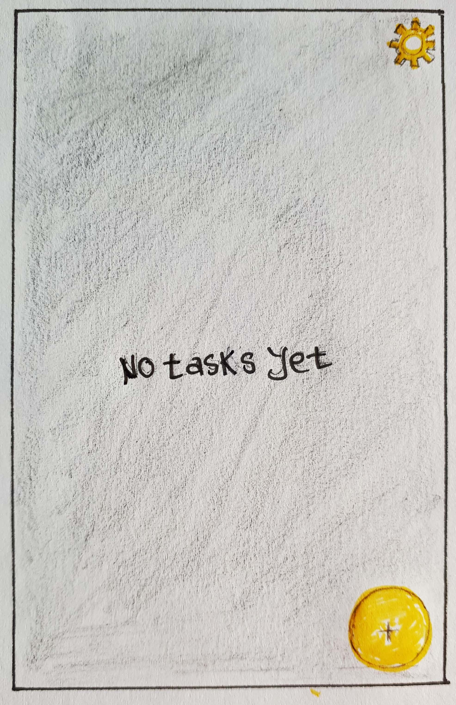
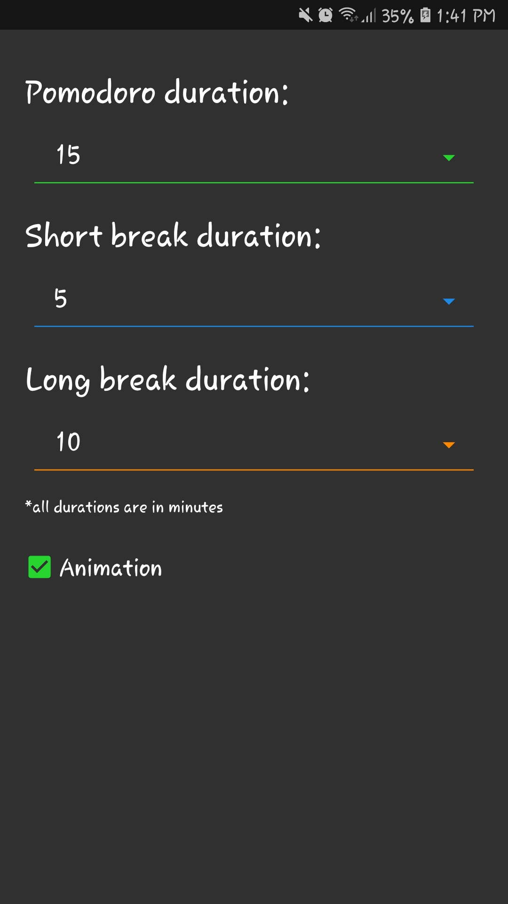

# PomoTodo
_PomoTodo_ is a mix of pomodoro technique, and simple Todo just in one small application.

Here are the development process of the app, and some screen shots while it is running

 

 

 

 

 

 

 

 

 

 

 

 

 

